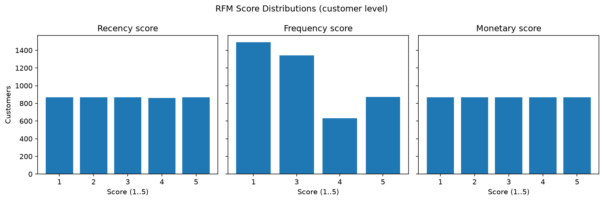
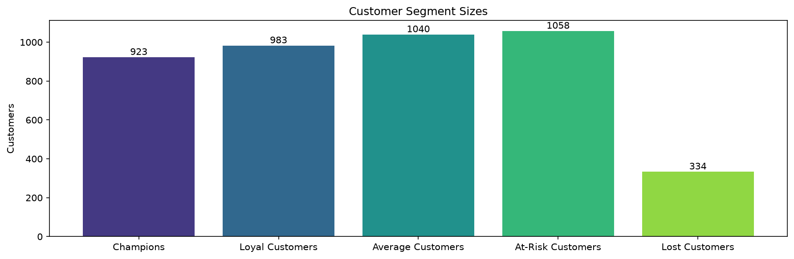
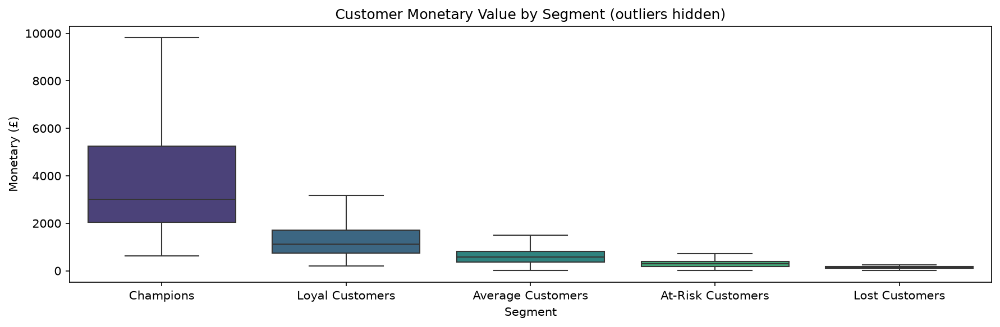
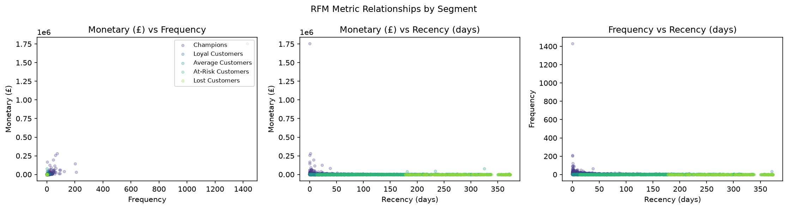

# PROJECT REPORT — Customer Segmentation Analysis using RFM Modeling

**Subject:** Python for Data Science (BE05000231) — PBL Micro-project
**Report phase:** Phase 14.1 — Project Report (foundation established; see §15/§16)
**Project status at time of writing:** Phases 1–13 COMPLETE · Phase 14 IN PROGRESS · Phase 15 NOT STARTED

> **Scope note (honesty):** This document is the formal Project Report,
> created by subphase **14.1** and completed by subphases **14.2** (Project
> Methodology, §17), **14.3** (Project Results, §18), **14.4**
> (Screenshots/Charts, §19) and **14.5** (Conclusion, §20). It documents the
> project exactly as implemented and verified through Phase 13, using only
> verified project facts. The remaining project work is Phase 15 — final
> audit, presentation and viva preparation — which has **not yet started**.

---

## 1. Project Title

Customer Segmentation Analysis using RFM Modeling

## 2. Project Overview

The project analyses a real e-commerce transaction dataset (OnlineRetail) and
transforms row-level transactions into customer-level behavioural insight.
Each customer is summarised with RFM metrics (Recency, Frequency, Monetary),
scored deterministically on a 1–5 scale per metric, and classified into one of
five approved segments. Statistical analysis quantifies the differences
between segments, four approved visualisations communicate the results, and
the insights/findings layer reports measured facts with interpretation
clearly separated from them. The full workflow is orchestrated end-to-end by
`main.py` (Phase 13).

## 3. Project Motivation

Businesses collect large volumes of customer transaction data, but this data
is frequently not properly analysed. When transaction records are merely
stored rather than examined, organisations miss opportunities to understand
who their most valuable customers are, recognise changing purchasing
behaviour, identify at-risk or inactive customers before they are lost,
tailor marketing and service to different customer groups, and allocate
resources efficiently. A raw transaction list shows isolated purchase events;
it does not reveal how recently a customer purchased, how often they buy, or
how much they are worth in total. RFM modelling compresses those three
behavioural dimensions into a compact, actionable, customer-level view that
supports targeted, data-driven decisions.

## 4. Problem Statement

Raw transaction records lack the summarised, customer-centric perspective
needed to understand and segment customer behaviour. There is a clear need
to: (1) identify customer purchasing patterns from raw transaction data;
(2) create customer segments that group similar customers together; and
(3) provide a data-driven basis for decisions such as targeted marketing,
retention, loyalty and customer-value management.

## 5. Project Objectives

The eight finalized objectives (approved in Phase 1.3), all achieved:

1. Analyse customer purchasing behaviour from transaction data.
2. Calculate Recency, Frequency, and Monetary (RFM) values for each customer.
3. Create a structured RFM representation of customers.
4. Classify customers into meaningful segments using RFM-based scoring/rules.
5. Perform appropriate statistical analysis on customer/RFM data.
6. Create clear visualizations for customer behavior, RFM metrics, and segments.
7. Derive useful customer, segment, and revenue-related insights.
8. Demonstrate practical Python for Data Science concepts through the project.

## 6. Project Scope

In scope (implemented): CSV loading with error handling; data cleaning
(missing values, exact duplicates, invalid records); EDA and descriptive
statistics; deterministic RFM calculation and tie-safe 1–5 scoring;
rule-based interpretable segmentation into five named segments; correlation,
normality and non-parametric segment-comparison statistics; four approved
matplotlib/seaborn charts; an insights/reporting layer; unittest-based
validation; end-to-end integration via `main.py`.

Explicitly out of scope (never claimed): GUI/web application, ML/clustering
models, production deployment, real-time processing, new dependencies beyond
the approved six. The approved Phase 8 record deliberately implements
rule-based classification ("no ML/clustering" is a documented non-goal).

## 7. Project Constraints

- Implementation language: Python (executed in the project `.venv`).
- Exactly six approved third-party libraries, pinned in `requirements.txt`:
  pandas 3.0.5, numpy 2.5.2, scipy 1.18.0, scikit-learn 1.9.0,
  matplotlib 3.11.1, seaborn 0.13.2. Dependency changes require review and
  documentation (TR-10).
- The approved OnlineRetail dataset is immutable; raw data is never modified.
- Methodology decisions (RFM rules, segment rules) are frozen by their owning
  phases; later phases consume them without alteration.
- A fixed 15-phase WBS governs all work; no plan changes are permitted.
- Academic alignment: the BE05000231 syllabus mapping (Units 1–7,
  CO-1..CO-5) constrains topics to genuinely used ones.

## 8. Dataset Overview

| Property | Verified value |
|---|---|
| Dataset | OnlineRetail (approved Phase 3) |
| Raw location | `data/raw/OnlineRetail.csv` |
| Raw rows × columns | 541,909 × 8 |
| Raw file size | 47,901,468 bytes |
| Raw SHA-256 | BFA47136118BC854A31E69D5C9E9689A2D07B73909F253679F2CC85EC4EB84EB |
| Final working dataset | `data/processed/OnlineRetail_invalid_removed.csv` — 524,878 × 8 |
| Unique customers | 4,338 |
| Observation window | 2010-12-01 to 2011-12-09 |

Processing chain (established Phase 5): missing-value handling →
exact-duplicate removal → invalid-record removal, persisted as three
processed CSVs (`OnlineRetail_cleaned.csv`, `OnlineRetail_deduplicated.csv`,
`OnlineRetail_invalid_removed.csv`). The raw file is read-only throughout.

## 9. Technology / Library Environment

| Library | Approved role | Version |
|---|---|---|
| pandas | tabular loading, cleaning, RFM aggregation | 3.0.5 |
| numpy | numeric foundation | 2.5.2 |
| scipy | inferential statistics (Phase 9) | 1.18.0 |
| scikit-learn | approved/pinned for segmentation scope (rule-based classifier implemented per approved record) | 1.9.0 |
| matplotlib | chart rendering | 3.11.1 |
| seaborn | statistical charts | 0.13.2 |

Compliance verified programmatically in Phase 12.5: an AST scan proves no
unapproved third-party import exists anywhere in `src/`.

## 10. Project Development Phases

All fifteen phases were executed strictly in order under the locked WBS:

| Phase | Title | Status |
|---|---|---|
| 0 | Project setup | COMPLETE |
| 1–3 | Initiation · Requirements & Scope · Dataset | COMPLETE |
| 4 | Data Loading & File Handling | COMPLETE |
| 5 | Data Cleaning & Preparation | COMPLETE |
| 6 | Exploratory Data Analysis | COMPLETE |
| 7 | RFM Calculation | COMPLETE |
| 8 | Customer Segmentation | COMPLETE |
| 9 | Statistical Analysis | COMPLETE |
| 10 | Data Visualization | COMPLETE |
| 11 | Insights & Findings (11.1–11.4) | COMPLETE |
| 12 | Testing & Validation (12.1–12.5) | COMPLETE |
| 13 | Final Integration (13.1–13.4) | COMPLETE |
| 14 | Documentation | **IN PROGRESS** (14.1 current) |
| 15 | Final Review / Presentation / Viva | NOT STARTED |

## 11. Implemented Architecture / Workflow

Modular design — one responsibility per `src/` module, orchestrated by the
entry point:

```
Raw CSV
  → src.data_loading          (Phase 4: load + type inspection + errors)
  → src.data_cleaning         (Phase 5: 5.1→5.2→5.3 + persistence)
  → src.statistics_analysis   (Phase 6 part: EDA summaries)
  → src.rfm_analysis          (Phase 7: R/F/M + tie-safe 1–5 scores)
  → src.segmentation          (Phase 8: rule-based five-segment mapping)
  → src.statistics_analysis   (Phase 9 part: correlations/normality/profiles/tests)
  → src.visualization         (Phase 10: four approved charts)
  → src.insights              (Phase 11: customer/segment/revenue/final findings)
  → main.py                   (Phase 13: end-to-end orchestration)
```

`main.py` reuses only these public functions — no business logic is
duplicated, and a single-pass design shares one Phase 9 summary between the
insights object and report rendering. Outputs land in config-defined
locations: `data/processed/`, `outputs/charts/`, `outputs/reports/`.

## 12. Current Implementation Status

- **Phases 1–13: COMPLETE.** All analytical modules implemented, the full
  WBS executed, and `main.py` orchestrates the real pipeline end-to-end
  (verified execution ≈ 19.4 s on the actual dataset).
- **Phase 14: IN PROGRESS.** 14.1 (this report) is the current subphase.
  14.2 Methodology, 14.3 Results, 14.4 Screenshots/Charts and
  14.5 Conclusion are NOT STARTED (placeholders in §15).
- **Phase 15: NOT STARTED** (audit, presentation, viva preparation).

## 13. Validation / Testing Status

Five dedicated Phase 12 suites plus a Phase 13 integration suite validate the
project; all run on the real dataset where applicable:

| Suite | Focus | Tests |
|---|---|---|
| test_environment | environment gate | 17 |
| test_data_loading | Phase 4 | 24 |
| test_data_cleaning | Phase 5 | 150 |
| test_statistics_analysis | Phases 6 + 9 | 28 |
| test_rfm_analysis | Phase 7 (+18 dedicated 12.3 checks) | 39 |
| test_segmentation | Phase 8 | 19 |
| test_visualization | Phase 10 | 14 |
| test_insights | Phase 11 (+12.x additions) | 92 |
| test_functional (12.1) | cross-phase functional validation | 23 |
| test_data_validation (12.2) | data-integrity validation | 45 |
| test_edge_cases (12.4) | edge/boundary behaviour | 13 |
| test_syllabus_compliance (12.5) | approved syllabus mapping | 16 |
| test_integration (13) | end-to-end orchestration | 12 |

**Final verified regression after Phase 13: 492 tests — OK** (0 failures,
0 errors). Key validations include independent recomputation of every
customer's RFM values from source transactions (12.3), raw-data immutability
via SHA-256 at every phase boundary, and deterministic-output checks.

## 14. Key Verified Project Facts

- Reference/analysis date: **2011-12-09** (dataset-max InvoiceDate).
- Customers analysed: **4,338** (one RFM row each; scores within 1–5).
- Segment counts (sum = 4,338): Champions **923**, Loyal Customers **983**,
  Average Customers **1,040**, At-Risk Customers **1,058**, Lost Customers
  **334**.
- Total revenue: **£10,642,110.80**; Champions revenue **£7,963,283.65**
  (**74.83%** of total revenue from 21.28% of customers); Lost Customers is
  the lowest-revenue segment.
- Frequency–Monetary Pearson correlation ≈ **+0.952** (strong positive);
  Kruskal-Wallis confirms significant monetary differences across segments.
- Four approved charts exist in `outputs/charts/`; the Phase 11 report
  (`outputs/reports/phase11_insights_report.md`) contains Segment Insights,
  Revenue Insights and Final Findings; the Phase 6 EDA report exists at
  `outputs/reports/phase6_eda_report.md`.
- Raw dataset unchanged throughout (SHA-256 verified repeatedly).

## 15. Documentation / Report Structure

Repository documentation as it stands:

- `README.md` — living source of truth: full WBS records for Phases 0–13.
- `docs/pbl_submission/MONTH_1.md`, `MONTH_2.md`, `MONTH_3.md` — month-wise
  PBL submission records with honesty notes.
- `outputs/reports/phase6_eda_report.md` — Phase 6 EDA deliverable.
- `outputs/reports/phase11_insights_report.md` — Phase 11 insights report.
- `docs/PROJECT_REPORT.md` — this formal Project Report (14.1 foundation).

### Project Report sections owned by later Phase 14 subphases

| Section | Owner | Status |
|---|---|---|
| Methodology (detailed per-phase method narrative) | 14.2 | **COMPLETE** (see §17) |
| Results (full results narrative beyond §14 facts) | 14.3 | **COMPLETE** (see §18) |
| Screenshots/Charts (embedded figures + captions) | 14.4 | **COMPLETE** (see §19) |
| Conclusion (final conclusions & limitations) | 14.5 | **COMPLETE** (see §20) |

## 16. Remaining Documentation Work

1. **14.2 Methodology** — **COMPLETE** (§17; documentation only, zero
   source-code changes; faithful to the implemented pipeline).
2. **14.3 Results** — **COMPLETE** (§18; all values cross-checked against
   repository evidence; measured facts separated from labelled interpretation).
3. **14.4 Screenshots/Charts** — **COMPLETE** (§19; documents the four
   existing approved Phase 10 charts with academic figure captions).
4. **14.5 Conclusion** — **COMPLETE** (§20; objectives revisited, principal
   conclusions with labelled interpretation, academic contribution,
   limitations, closing statement — no claims beyond verified evidence).
5. **Phase 15** — final audit, presentation and viva preparation — not
   started. This is the only remaining project work.

None of these are fabricated or pre-marked complete; this report claims only
what has been executed and verified through Phase 13.

## 17. Project Methodology (Phase 14.2)

This section documents the methodology **actually implemented and verified**
in Phases 4–13. Every formula, rule and threshold below is reproduced from
the project's source code (`src/*.py`) and approved records — no new method,
re-interpretation or generic-textbook substitution has been introduced. The
workflow is fully **deterministic and rule-based**: identical inputs always
produce identical outputs. It contains **no machine learning, clustering or
predictive modelling**, and draws no causal claims. Each stage states its
purpose, actual processing, implementation location, input→output relation,
and the validation already performed on it.

### 17.1 Dataset Loading & Inspection (Phase 4)

- **Purpose:** bring the approved raw dataset into memory faithfully and
  reproducibly, with typed dates and controlled failure behaviour.
- **Processing / implementation:** `src/data_loading.py::load_raw_dataset()`
  reads `data/raw/OnlineRetail.csv` via pandas `read_csv`, parsing
  `InvoiceDate` to datetime64 during load; the dataset schema is validated
  against the Phase 3 data dictionary (8 columns) and the known shape
  (541,909 rows); a missing file raises a clear, handled error path.
  Loading is strictly read-only — tests assert the input file is not mutated.
- **Input→output:** immutable raw CSV → in-memory transaction DataFrame.
- **Validation:** 24 Phase 4 tests; read-only + dtype checks re-verified in
  Phase 12.1/12.2; raw SHA-256 checked at every phase boundary.

### 17.2 Data Cleaning & Preparation (Phase 5)

Three documented sequential decisions are applied by `src/data_cleaning.py`
(`handle_missing_values`, `remove_duplicates`, `remove_invalid_records`),
each returning a fresh copy and never touching the raw CSV:

1. **Missing values (5.1):** `Description` has 1,454 missing values
   (0.2683%). They are deliberately **preserved as NaN** — imputation would
   fabricate data, which the project disallows — because affected rows carry
   valid CustomerID/Quantity/UnitPrice needed later. No other column has
   missing values at this stage.
2. **Exact duplicates (5.2):** exact-duplicate rows are counted
   (`get_duplicate_count`) then removed with `keep="first"`:
   **5,268 rows removed → 536,641 rows** (documented before/after table).
3. **Invalid records (5.3):** a union mask `is_invalid_record` applies exactly
   three approved rules without double counting —
   **R1** cancellation invoices (`InvoiceNo` starting "C");
   **R2** non-positive `Quantity` on *non-cancellation* invoices;
   **R3** non-positive `UnitPrice`. Result: the **final working dataset of
   524,878 rows × 8 columns**, persisted as
   `data/processed/OnlineRetail_invalid_removed.csv`.
   Negative quantities are handled solely through R1 invoice status, never a
   blind negative filter.

Owner-approved verification gates confirmed **zero additional filtering
(5.4), no outlier handling changes (5.6), and no aggregation into the working
dataset (5.7)** — so cleaning stops at documented decision points rather than
inventing rules.

- **Input→output:** raw frame → cleaned/deduplicated/invalid-removed CSVs
  (all three persisted for provenance).
- **Validation:** 150 Phase 5 tests plus the 45 Phase 12.2 integrity checks
  (schema chain, row relationships, type retention).

### 17.3 Exploratory Data Analysis (Phase 6)

- **Purpose:** describe the real data before modelling; ground every later
  decision in measured facts.
- **Processing / implementation:** `build_phase6_eda_summary()` and helpers in
  `src/statistics_analysis.py` compute a dataset summary, top countries by
  revenue, numeric distribution summaries, monthly trends and metric
  relationships. Transaction revenue is derived as `Quantity × UnitPrice`
  — the definition reused consistently by RFM Monetary and revenue insights.
- **Input→output:** working transaction dataset → EDA summary dict + the
  deliverable report `outputs/reports/phase6_eda_report.md`.
- **Validation:** covered by the dedicated statistics test suite
  (Phases 6+9, 28 tests) on real data.

### 17.4 Analysis Date Selection (Phase 7.1)

The single reference/analysis date defaults to the **maximum InvoiceDate of
the working dataset — 2011-12-09** — and one date is used for the whole
cohort, keeping Recency comparable across customers. An explicit override is
supported (used by tests to prove recency responds correctly to the chosen
date). Selection is deterministic given the dataset.

### 17.5 Recency, Frequency & Monetary Calculation (Phases 7.2–7.4)

`calculate_customer_rfm()` groups transactions per customer:

- **Recency:** `recency_days = reference_date − customer's last purchase`,
  in whole days (≥ 0); the customer's own latest qualifying invoice date is
  used.
- **Frequency:** count of the customer's **distinct invoices**
  (`InvoiceNo.nunique()`).
- **Monetary:** sum of row-level revenue `Σ(Quantity × UnitPrice)` for the
  customer.

- **Validation:** Phase 12.3 independently recomputed all three metrics for
  every customer from the raw transaction rows (pandas groupby) and matched
  them element-wise against the Phase 7 output; total Monetary equals total
  dataset revenue (£10,642,110.80).

### 17.6 RFM Table Construction (Phase 7.5)

`build_rfm_analysis()` produces exactly **one row per customer**
(4,338 customers) with the columns `CustomerID`, `last_purchase`,
`recency_days`, `frequency`, `monetary`; `score_rfm_table()` returns a copy
with three additional score columns, leaving inputs unmutated. Customer
identity is preserved (set-equality with source data, no duplicates,
no missing values — both tested on real data).

### 17.7 RFM Scoring (Phase 7.6)

Scores are assigned by a documented **rank-position rule** — *not* quantile
bucketing. For each metric's population of *n* customer values:

```
below      = count of values strictly less than v
inclusive  = count of values up to and including v
position   = (below + inclusive) / (2n)          # midpoint of the two fractions
score      = int(position × 5) + 1               # maps into 1..5
```

Tied values share identical `(below, inclusive)` counts and therefore receive
identical scores by construction. Recency is reversed (`6 − score`) because
*fewer* days since last purchase is better; Frequency and Monetary rank
upward. Scores are always within the approved **1–5** range.

- **Validation:** Phase 12.3 cross-checked scores against an independent
  pure-Python reimplementation of this exact rule and verified
  score-vs-metric monotonicity across all real customers for all three
  metrics; determinism and tie behaviour have dedicated tests.

### 17.8 Customer Segmentation (Phase 8)

Segmentation is **rule-based and deterministic** — no clustering, no machine
learning, no predictive modelling. Each customer's three RFM scores are
summed into a combined score

```
rfm_total = recency_score + frequency_score + monetary_score     # range 3..15
```

which is mapped through fixed, approved thresholds (`src/segmentation.py`)
to exactly one of five named segments:

| rfm_total | Segment |
|---|---|
| 13 – 15 | Champions |
| 10 – 12 | Loyal Customers |
| 7 – 9 | Average Customers |
| 4 – 6 | At-Risk Customers |
| 3 | Lost Customers |

Identical RFM scores always yield the same segment; every customer receives
exactly one segment. Invalid input (empty/missing columns/non-numeric scores)
raises a clear `ValueError`, matching the project-wide error contract.

- **Real-data result:** Champions **923**, Loyal Customers **983**,
  Average Customers **1,040**, At-Risk Customers **1,058**, Lost Customers
  **334** — summing exactly to 4,338.
- **Validation:** 19 Phase 8 tests plus Phase 11/12 consistency checks
  (one segment per customer; summary agrees with the segmented table).

### 17.9 Statistical Analysis (Phase 9)

`build_phase9_statistical_summary()` analyses the segmented real data via
`scipy.stats`, using only the methods approved in Phase 9:

- **Central tendency & dispersion:** per-segment customer counts with
  Frequency/Monetary means and medians (e.g., Champions mean frequency 13.38,
  mean Monetary £8,627.61; Lost Customers £145.73).
- **Distribution analysis:** D'Agostino–Pearson normality tests on the RFM
  metrics, justifying the use of non-parametric comparison tests.
- **Correlation analysis:** Pearson and Spearman correlations between RFM
  metrics — notably Frequency–Monetary Pearson r ≈ **+0.952**.
- **Segment comparison:** Kruskal–Wallis H tests across the five segments
  (df = 4): Frequency H = 3,507.14 and Monetary H = 3,177.53, both p ≈ 0;
  followed by pairwise Mann–Whitney U tests (e.g., Champions vs Lost:
  Monetary U = 308,282, p ≈ 6.7e-162).

No statistical test was added or removed after approval; results are
deterministic for the fixed dataset.

### 17.10 Data Visualization (Phase 10)

`src/visualization.py` renders the **four approved charts** with
matplotlib/seaborn on a headless Agg backend into `outputs/charts/`
(path from `config.py`; no new directories):

1. `rfm_score_distributions.png` — three-panel bar chart of how many
   customers hold each Recency/Frequency/Monetary score (1–5).
2. `segment_size_bar.png` — customers per Phase 8 segment, annotated counts.
3. `segment_monetary_box.png` — Monetary distribution per segment (outliers
   hidden to keep the heavily skewed real distribution readable).
4. `rfm_metric_correlation_scatter.png` — pairwise RFM metric scatter panels,
   coloured by segment; visual counterpart of the Phase 9 correlations.

Rendering is deterministic (fixed figure sizes, fixed palette and fixed
segment order), plots **every customer without sampling**, never mutates its
input, and raises clear `ValueError`s on invalid input. The input is the
existing Phase 8 segmented table via
`build_phase10_visualization_input()` — no analysis is recomputed.

### 17.11 Insight Generation (Phase 11)

The insights layer (`src/insights.py`) is **derived-only**: it consumes the
verified Phase 8/9 outputs and adds no new analysis or recalculation.

- **11.1 Customer Insights** — customer population/profile facts and
  statistically supported customer-level patterns from the Phase 9 summary.
- **11.2 Segment Insights** — per-segment RFM-score/Recency characteristics
  of the five real segments.
- **11.3 Revenue Insights** — revenue per segment (sum of customer Monetary),
  revenue share %, mean/median Monetary per segment, highest/lowest-revenue
  segments and concentration patterns.
- **11.4 Final Findings** — synthesis of 11.1–11.3 into measured findings,
  each with `measured` facts separated from `interpretation`.

Findings are rendered by `render_phase11_insights_markdown()` into
`outputs/reports/phase11_insights_report.md` (Report §"Final Findings"),
with invalid/malformed insight inputs rejected by explicit validation.

### 17.12 End-to-End Integration (Phase 13)

`main.py` orchestrates the existing public functions in a single fixed pass:

```
Raw CSV → Data Loading → Cleaning & Preparation → EDA → RFM (build + score)
        → Segmentation → Statistical Analysis → Visualization
        → Insights & Findings → Markdown report
```

All paths come from `config.py` (raw/processed data, `outputs/charts/`,
`outputs/reports/`). Integration is **reuse-only** — no business logic is
duplicated, no RFM or segmentation recalculated — and it logs measured facts
per stage. On the real dataset the complete workflow runs in ≈ **19.4 s**
and exits successfully.

- **Validation:** dedicated integration suite executes the real pipeline and
  checks every stage's output, artifact existence and single-pass behaviour;
  the full 492-test regression remains green afterwards.

Across all stages, methodology (*what* is computed and *why*), implementation
(*where*, in code) and validation (*how correctness was established*) are kept
as distinct concerns — consistent with the Phase 12 validation phase, which
confirmed data immutability, deterministic outputs and reproducibility end-to-end.

## 18. Project Results (Phase 14.3)

This section reports the **actual, already-verified results** produced by the
implemented pipeline (Phases 4–13) on the real OnlineRetail dataset. Every
number below was cross-checked against the repository evidence before being
committed here — the Phase 11 insights report, the Phase 6 EDA report and the
verified README records are the primary sources; no new analysis was run for
this documentation and no value is invented. Each subsection keeps **measured
results** separate from **interpretation**, which is clearly labelled as such.
Detailed figure documentation is in §19; methodology is in §17.

### 18.1 Dataset and Data Preparation Results

**Measured results (Phases 4–5):**

| Stage | Rows | Columns |
|---|---:|---:|
| Raw dataset loaded (`OnlineRetail.csv`) | 541,909 | 8 |
| After exact-duplicate removal (5,268 rows removed) | 536,641 | 8 |
| Final working dataset (`OnlineRetail_invalid_removed.csv`) | **524,878** | **8** |

- Missing-value decision (5.1): `Description` carried 1,454 missing values
  (0.2683%); preserved as NaN rather than imputed (imputation would fabricate
  data). No other column had missing values at that stage.
- Invalid records removed by the R1–R3 union mask (cancellation invoices;
  non-positive Quantity on non-cancellation invoices; non-positive UnitPrice).
- Owner-approved gates confirmed zero additional filtering/outlier handling/
  aggregation changed the data (subphases 5.4/5.6/5.7).
- Unique customers identified downstream: **4,338**.
- The raw file remained byte-identical throughout (SHA-256
  `BFA47136…84EB`, 47,901,468 bytes, re-verified at every phase boundary).

### 18.2 Exploratory Data Analysis Results

**Measured results (Phase 6, real data):**

- Unique customers: **4,338**; total transaction revenue:
  **£10,642,110.80** (consistent with all later stages).
- Working-data numeric profile (min / median / mean): Quantity 1 / 4 /
  ≈10.62; UnitPrice £0.001 / £2.08 / ≈£3.92.
- Monthly transactions ranged from ≈1,086 (2011-01) to ≈1,681 (2011-05) in
  the documented trend sample, with corresponding revenue variation.
- Top countries by revenue (measured): United Kingdom (£9,001,744.09),
  Netherlands (£285,446.34), EIRE (£283,140.52), Germany (£228,678.40),
  France (£209,625.37).
- Deliverable: `outputs/reports/phase6_eda_report.md`.

### 18.3 RFM Analysis Results

**Measured results (Phase 7):**

- One RFM record per customer: **4,338 rows**, no duplicates, no missing
  RFM values (validated on real data).
- Analysis/reference date: **2011-12-09** (dataset-max InvoiceDate).
- Recency = reference date − customer's last purchase (days);
  Frequency = distinct invoices; Monetary = Σ(Quantity × UnitPrice).
- All three score columns constrained to the approved **1–5** range,
  produced by the documented rank-position rule with recency reversed.
- Independent verification (Phase 12.3) recomputed every customer's R/F/M
  from source transactions and matched element-wise; total Monetary equals
  total dataset revenue exactly.

### 18.4 Customer Segmentation Results

**Measured results (Phase 8 rules applied to real scores):**

| Segment | Customers | Share |
|---|---:|---:|
| Champions | 923 | 21.28% |
| Loyal Customers | 983 | 22.66% |
| Average Customers | 1,040 | 23.97% |
| At-Risk Customers | 1,058 | 24.39% |
| Lost Customers | 334 | 7.70% |
| **Total** | **4,338** | **100.00%** |

- Sum check: 923 + 983 + 1,040 + 1,058 + 334 = **4,338** (verified).
- Largest segment: **At-Risk Customers (1,058)**; smallest:
  **Lost Customers (334)**; every customer has exactly one segment.

### 18.5 Revenue Results

**Measured results (Phase 11.3; revenue = sum of per-customer Monetary):**

| Segment | Revenue | Revenue Share |
|---|---:|---:|
| Champions | £7,963,283.65 | 74.83% |
| Loyal Customers | £1,408,919.51 | 13.24% |
| Average Customers | £876,279.96 | 8.23% |
| At-Risk Customers | £344,952.81 | 3.24% |
| Lost Customers | £48,674.87 | 0.46% |
| **Total** | **£10,642,110.80** | **100.00%** |

- Highest-revenue segment: **Champions**; lowest-revenue segment:
  **Lost Customers**.
- Revenue concentration (measured): Champions contribute **74.83%** of total
  revenue while representing only **21.28%** of customers.

*Interpretation (not measured data):* this indicates substantial revenue
concentration within the Champions segment and supports prioritising the
retention of high-value customers; the low-revenue segments contribute
comparatively little to total revenue.

### 18.6 Statistical Analysis Results

**Measured results (Phase 9, scipy.stats on the real segmented data):**

RFM metric correlations (n = 4,338):

| Pair | Pearson r | Spearman ρ |
|---|---:|---:|
| Recency vs Frequency | −0.1004 | −0.5628 |
| Recency vs Monetary | −0.0521 | −0.4811 |
| Frequency vs Monetary | **+0.9519** | +0.8073 |

Normality (D'Agostino–Pearson): all three RFM metrics are **not normal**
at the 0.05 level — recency statistic = 731.29 (p ≈ 1.59e-159); frequency
statistic = 14,251.38 (p ≈ 0); monetary statistic = 14,349.24 (p ≈ 0) —
justifying the non-parametric comparison approach.

Segment comparison tests:

| Test | Statistic | p-value |
|---|---:|---:|
| Kruskal–Wallis H (Frequency across 5 segments, df = 4) | 3,507.14 | ≈ 0 |
| Kruskal–Wallis H (Monetary across 5 segments, df = 4) | 3,177.53 | ≈ 0 |
| Mann–Whitney U (Champions vs Lost, Frequency) | 308,282.00 | ≈ 2.01e-165 |
| Mann–Whitney U (Champions vs Lost, Monetary) | 308,282.00 | ≈ 6.74e-162 |

Per-segment profiles (measured means / medians): Champions frequency 13.38 /
8 and monetary £8,627.61 / £3,018.63 down to Lost Customers frequency 1.00 /
1 and monetary £145.73 / £143.28.

*Interpretation (not measured data):* the segment differences are
statistically significant rather than attributable to random variation, and
the strong Frequency–Monetary association is consistent with using RFM
rather than any single metric for segmentation. These associations do not
establish causation.

### 18.7 Visualization Results

The four approved Phase 10 charts were generated deterministically from the
real data (full documentation in §19): `rfm_score_distributions.png`,
`segment_size_bar.png`, `segment_monetary_box.png` and
`rfm_metric_correlation_scatter.png`. Their content visually agrees with the
measured results above (segment sizes summing to 4,338; per-segment monetary
spread; the Frequency–Monetary association). No new chart was created during
documentation.

### 18.8 Customer and Business Insights

**Measured findings (Phase 11.1–11.4, derived only from verified upstream
outputs):**

- Customer population: **4,338**, across exactly five verified segments.
- Champions are simultaneously the highest-value (mean Monetary) and
  highest-revenue segment; At-Risk Customers is the largest customer
  segment but contributes only 3.24% of revenue; Lost Customers is both the
  smallest and lowest-revenue segment.
- Segment score profiles are monotonic (e.g., mean Recency score declines
  from 4.52 for Champions to 1.00 for Lost Customers), consistent with the
  segmentation rule's design.
- Strongest RFM pattern: Frequency–Monetary Pearson r ≈ **+0.952**,
  matching the Phase 10 scatter evidence.

*Interpretation (not measured data):* two business priorities emerge from
these measurements — protecting the Champions segment disproportionately
protects revenue, and re-engaging At-Risk customers addresses the largest
group before they lapse further. The small, low-value Lost group warrants
minimal recovery effort. These are analytical conclusions, not guarantees
of outcomes.

### 18.9 End-to-End Integration Results

**Measured results (Phase 13 real execution of `main.py`):**

- Command `python main.py` completed successfully (**exit code 0**) in
  approximately **19.4 seconds** on the real dataset.
- Pipeline flow executed in order: raw loading → cleaning → EDA → RFM →
  segmentation → statistics → visualization → insights/report, reusing the
  existing public functions once (no duplicate processing).
- Verified stage outputs: 541,909 raw rows loaded; three processed datasets
  persisted; working dataset 524,878 rows; 4,338 customers scored;
  five segments (923/983/1,040/1,058/334); four PNG charts generated into
  `outputs/charts/`; Phase 11 markdown report written to
  `outputs/reports/phase11_insights_report.md`.

### 18.10 Overall Results Summary

Measured, the project converted 541,909 raw transaction rows into a clean
524,878-row working dataset covering 4,338 customers; produced validated R/F/M
metrics and 1–5 scores for every customer; classified every customer into one
of five deterministic segments summing exactly to the population; quantified a
total revenue of £10,642,110.80 with 74.83% concentrated in Champions;
confirmed statistically significant differences between all segments
(Kruskal–Wallis p ≈ 0) alongside a strong Frequency–Monetary association
(r ≈ +0.952); rendered four deterministic charts; and documented all findings
in a reproducible insights report — the whole workflow executing end-to-end via
`main.py` in ~19.4 s under a validation regime totalling 492 passing tests with
the raw dataset byte-identical throughout.


## 19. Screenshots / Charts (Phase 14.4)

This section documents the **four approved Phase 10 visualization outputs**
exactly as generated by `src/visualization.py` (`build_phase10_visualizations`)
on the real project dataset into the approved location `outputs/charts/`
(`config.CHARTS_DIR`). No chart was created, regenerated for this subphase,
or altered; every figure below is an existing, verified artifact. All four
files were verified present with valid PNG signatures during 14.4. The
charts are rendered from the Phase 8 segmented customer table (4,338 real
customers) — no synthetic or demo data is involved. Rendering is fully
deterministic (fixed figure sizes, fixed palette/segment order, headless Agg
backend), so the figures correspond exactly to the current verified dataset.
Per the project's honesty rules, observations state measured associations
only — no causal claims are made.

### 19.1 RFM Score Distributions

**Figure 19.1 — Distribution of customer Recency, Frequency and Monetary
scores (1–5) across the analysed population**



- **Artifact:** `outputs/charts/rfm_score_distributions.png` (valid PNG)
- **Chart type:** three-panel bar chart (one panel per RFM metric)
- **Purpose:** show how the Phase 7 rank-position scoring distributed the
  4,338 customers over each metric's 1–5 score levels.
- **Represents:** the count of customers holding each Recency, Frequency and
  Monetary score, visualising the score populations that feed the combined
  RFM-total segmentation rule (§17.8).
- **Verified observation:** the distributions underlie the measured segment
  spread reported in §14 (segments ranging from 923 Champions to 334 Lost
  Customers); tied values share identical scores by construction of the
  documented scoring rule.

### 19.2 Segment Size Bar Chart

**Figure 19.2 — Number of customers per approved segment**



- **Artifact:** `outputs/charts/segment_size_bar.png` (valid PNG)
- **Chart type:** annotated vertical bar chart
- **Purpose:** communicate the size of each Phase 8 segment.
- **Represents:** one bar per approved segment in fixed best-first order
  (`SEGMENT_ORDER`), with counts annotated on each bar.
- **Verified observation:** largest segment At-Risk Customers (**1,058**),
  smallest Lost Customers (**334**); all five bars sum exactly to the
  4,338-customer population (Champions 923 · Loyal Customers 983 · Average
  Customers 1,040 · At-Risk Customers 1,058 · Lost Customers 334).

### 19.3 Segment Monetary Box Plot

**Figure 19.3 — Monetary-value distribution per customer segment**



- **Artifact:** `outputs/charts/segment_monetary_box.png` (valid PNG)
- **Chart type:** box plot per segment (extreme outliers hidden for
  readability of the heavily skewed real monetary distribution)
- **Purpose:** contrast how customer monetary value is distributed inside
  each segment rather than only comparing averages.
- **Represents:** per-segment Monetary (Σ Quantity × UnitPrice per customer)
  spread from the Phase 8 segmented table.
- **Verified observation:** Champions show the highest central monetary
  level (mean £8,627.61) and Lost Customers the lowest (mean £145.73);
  these are the same measured values reported by Phase 9/11 — no new
  statistic is derived from the figure itself.

### 19.4 RFM Metric Correlation Scatter

**Figure 19.4 — Pairwise relationships between Recency, Frequency and
Monetary, coloured by segment**



- **Artifact:** `outputs/charts/rfm_metric_correlation_scatter.png` (valid PNG)
- **Chart type:** pairwise scatter panels coloured by segment (no sampling —
  every customer plotted)
- **Purpose:** provide the visual counterpart of the Phase 9 correlation
  analysis between the RFM metrics.
- **Represents:** the joint behaviour of R/F/M pairs across all segments.
- **Verified observation:** visually consistent with the measured strong
  positive Frequency–Monetary association (Pearson r ≈ +0.952) documented in
  §14; the figure illustrates the association, it does not establish
  causation.

The four figures above are the complete approved chart set; no additional or
replacement chart exists in `outputs/charts/`.

## 20. Conclusion (Phase 14.5)

This closing section draws together the project as implemented and verified
through Phase 13. Conclusions below rest exclusively on the measured results
documented in §18; interpretations are labelled as such, and no causal,
predictive or deployment claim is made beyond what the implementation actually
does.

### 20.1 Objectives Revisited

All eight objectives approved in Phase 1.3 were achieved by the completed
work:

| # | Objective (approved Phase 1.3) | Where achieved |
|---|---|---|
| 1 | Analyse customer purchasing behaviour from transaction data | Phases 5–6 (524,878-row working dataset; EDA) |
| 2 | Calculate Recency, Frequency and Monetary per customer | Phase 7 (4,338 customers; independently verified in 12.3) |
| 3 | Create a structured RFM representation of customers | Phase 7.5/7.6 (one row per customer; scores 1–5) |
| 4 | Classify customers into meaningful segments using RFM-based rules | Phase 8 (five approved segments; every customer classified) |
| 5 | Perform appropriate statistical analysis on customer/RFM data | Phase 9 (correlation, normality, Kruskal–Wallis, Mann–Whitney) |
| 6 | Create clear visualizations for behaviour, RFM metrics and segments | Phase 10 (four approved deterministic charts) |
| 7 | Derive useful customer, segment and revenue-related insights | Phase 11 (11.1–11.4 with measured-vs-interpretation separation) |
| 8 | Demonstrate practical Python for Data Science concepts | Entire pipeline + integration + validation (Phases 4–13) |

### 20.2 Principal Conclusions

**Measured basis (from §18):** the project converted 541,909 raw transaction
rows into a validated 524,878-row working dataset covering 4,338 customers;
produced independently verified RFM metrics and 1–5 scores for every customer;
classified every customer into exactly one of five deterministic segments
(Champions 923 · Loyal Customers 983 · Average Customers 1,040 · At-Risk
Customers 1,058 · Lost Customers 334); quantified total revenue of
£10,642,110.80 with 74.83% concentrated in Champions despite their 21.28%
customer share; established that segment differences in Frequency and Monetary
are statistically significant (Kruskal–Wallis H = 3,507.14 and 3,177.53,
p ≈ 0) alongside a strong Frequency–Monetary association (Pearson r ≈ +0.952);
and executed the entire workflow end-to-end via `main.py` in ≈19.4 s under a
492-test validation regime with the raw dataset byte-identical throughout.

*Interpretation (not measured data):* within the limits of this descriptive,
rule-based analysis, the results indicate that a small, recently active,
high-spending group dominates revenue while the largest customer group is
already at risk — so retention of the top segment and re-engagement of the
At-Risk group are the analysis-supported business priorities. The observed
metric associations justify RFM-based segmentation over any single metric.
These conclusions describe this dataset under these rules; they are not
predictions of future customer behaviour and do not establish causation.

### 20.3 Academic Contribution (Python for Data Science)

Consistent with the approved syllabus mapping (README §2.4, Units 1–7 /
CO-1..CO-5), the project demonstrates in one coherent pipeline: real-world CSV
file handling with typed dates and exception paths (Unit 2); the applied data
science lifecycle from cleaning through EDA to communication (Unit 3);
Pandas/NumPy data structures and transformations throughout (Units 2–6);
SciPy inferential statistics on real, non-normal data with justified
non-parametric choices (Unit 5); systematic data preparation under documented
decisions (Unit 6); and Matplotlib/Seaborn visualisation rendered
deterministically (Unit 7) — all delivered inside an owned virtual environment
restricted to the six approved libraries (verified by AST scan in Phase 12.5).

### 20.4 Limitations

Honest limitations of the delivered work:

1. **Descriptive and rule-based only** — segmentation is a fixed threshold
   mapping of summed RFM scores (§17.8); no clustering, machine learning or
   predictive modelling was used or claimed (scikit-learn is approved/pinned
   but deliberately unused for segmentation).
2. **Snapshot analysis** — conclusions describe the OnlineRetail dataset as
   it stands; results would change with new transactions or a different
   reference date (the reference date is an explicit parameter).
3. **No causal inference** — correlations and group differences are
   associations between measured quantities; nothing here establishes that
   one factor causes another.
4. **Scope boundaries respected** — no GUI/web application, dashboard,
   production deployment or scheduled execution exists; the deliverable is
   the Python pipeline, its artifacts and this documentation.
5. **Interpretations are context-dependent** — the business readings in
   §18/§20.2 are reasonable inferences from measurements, not guarantees.

### 20.5 Closing Statement

The project set out to transform raw transaction records into actionable,
customer-level understanding, and did so with full traceability: every number
in this report traces to code, data and tests recorded in the locked WBS,
Phases 1–13 are complete and validated (492 tests), and Phase 14 documentation
(Methodology §17, Results §18, Charts §19, this Conclusion §20) reflects only
what was genuinely built and verified. The remaining work is Phase 15 — final
audit, presentation and viva preparation — which has not been started.


